# Mat de vision — Mat-CDFR2027

Mat de vision à base de tags **ArUco**, écrit en **C++17** avec **OpenCV** : une
caméra fixée sur un mât au-dessus d'une table de jeu repère les 4 tags de coin de
la table, en déduit la **pose de la caméra dans le repère de la table**
(`solvePnP`), puis renvoie la position (x, y, z, angle) des objets marqués sur le
tapis via une **API REST** accessible sur le réseau local — avec une **interface
web** de pilotage intégrée.

La position de chaque objet est obtenue par **changement de base** : la pose de
son tag (calculée par `solvePnP`) est composée avec la pose caméra-table. Il n'y
a **aucune homographie**.

* **Cible matérielle** : LattePanda Delta (x86, Ubuntu) + webcam USB
  Logitech 4K Stream Edition.
* **Table** : 2000 mm × 3000 mm ; tags de coin à ±400 mm / ±900 mm du centre.
* **Sortie** : JSON en millimètres dans le repère table, origine au centre.
* **Calibration intrinsèque obligatoire** : sans elle, aucune pose (donc aucune
  position) ne peut être calculée.

---

## 1. Fonctionnalités

| # | Fonction | Où |
|---|----------|-----|
| 1 | **API web** (JSON, CORS, aperçu JPEG, flux MJPEG, supervision) cpp-httplib | `src/api.cpp`, `src/main_server.cpp` |
| 2 | **Calibration automatique** des intrinsèques (damier, sans toucher au clavier) | `src/calibration.cpp`, `src/main_calibrate.cpp` |
| 3 | **Module vision ArUco** : 4 tags de coin → pose caméra (`solvePnP`) → objets | `src/aruco.cpp`, `src/table.cpp` |
| 4 | Relevé des positions une entrée par tag détecté (mm / degrés, par changement de base) | `src/vision.cpp` |
| 5 | **Interface web multi-onglets** : stratégie, live table, vision, robot principal | `web/` |
| 6 | **Flotte de robots** : pilotage stratégie/couleur du principal, du chasseur et de l'essaim | `src/fleet.cpp` |

L'image complète n'est **pas** analysée : les 4 tags de coin servent d'abord à
estimer la pose caméra, puis une **région d'intérêt (ROI)** couvrant toute la
surface de jeu ; la détection des objets n'est faite qu'à l'intérieur de cette
zone (`table.roi_mode`, voir §9).

---

## 2. Architecture

```mermaid
flowchart LR
    CAM["Webcam USB<br/>Logitech 4K Stream"] --> ENG["VisionEngine<br/>(une seule boucle)"]
    ENG --> AR["ArucoDetector<br/>détection des tags"]
    AR --> CORN["4 tags de coin"]
    CORN --> POSE["Pose caméra dans le repère table<br/>solvePnP (intrinsèques requises)"]
    POSE --> ROI["Masque ROI"]
    ROI --> AR2["Détection des objets"]
    AR2 --> TAG["Pose de chaque tag<br/>solvePnP"]
    TAG --> MAP["Changement de base<br/>caméra → table"]
    MAP --> OUT["Position en mm / degrés<br/>repère table"]
    OUT --> API["API HTTP (cpp-httplib)"]
    API -->|JSON / JPEG / MJPEG| WEB["Interface web<br/>/ui"]
    API -->|JSON| LAN["Réseau local<br/>curl, robot, supervision"]
    CAL["AutoCalibrator<br/>(damier)"] -.->|intrinsèques| POSE
    WEB -.->|POST /start, /stop,<br/>/calibration/*| API
```



### Structure du dépôt

```
Mat-CDFR2027/
├── CMakeLists.txt                # build C++ (OpenCV + cpp-httplib + nlohmann/json)
├── config/
│   └── default.json              # configuration complète (caméra, table, objets…)
├── data/                         # calibration et captures (généré)
├── include/matvision/            # en-têtes publics
│   ├── api.hpp                   # serveur HTTP (routes, aperçu, flux)
│   ├── aruco.hpp                 # détecteur ArUco + tracé
│   ├── calibration.hpp           # Intrinsics, AutoCalibrator
│   ├── camera.hpp                # source d'images (webcam USB, IFrameSource)
│   ├── config.hpp                # structures de configuration
│   ├── fleet.hpp                 # flotte de robots
│   ├── geometry.hpp              # Position, angles, coins de tags, ROI, projection
│   ├── logger.hpp                # journalisation console
│   ├── table.hpp                 # pose caméra (solvePnP) + changement de base
│   └── vision.hpp                # moteur (boucle, modes, relevé des objets)
├── src/
│   ├── api.cpp                   # routes + interface web + MJPEG
│   ├── aruco.cpp
│   ├── calibration.cpp
│   ├── camera.cpp
│   ├── config.cpp
│   ├── fleet.cpp
│   ├── geometry.cpp
│   ├── logger.cpp
│   ├── table.cpp
│   ├── vision.cpp
│   ├── main_server.cpp           # binaire matvision-server
│   └── main_calibrate.cpp        # binaire matvision-calibrate
├── web/
│   ├── index.html                # page de l'interface web (4 onglets)
│   └── static/
│       ├── app.js                # onglet Vision (aperçu, plan, calibration)
│       ├── tabs.js               # navigation entre les onglets
│       ├── fleet.js              # onglets Stratégie et Live table
│       ├── robot.js              # onglet Robot principal (iframes)
│       ├── map.svg               # map de l'année (fond de la table live)
│       └── style.css             # thème sombre
├── tests/
│   └── test_main.cpp             # tests d'intégration sans matériel
└── third_party/                  # cpp-httplib (HTTP) + nlohmann/json
```

---

## 3. Compilation

Prérequis : un compilateur C++17, **CMake ≥ 3.16** et **OpenCV ≥ 4.7**
(modules `core`, `imgproc`, `imgcodecs`, `videoio`, `highgui`, `calib3d`,
`objdetect`, `aruco`). Sur Debian/Ubuntu :

```bash
sudo apt install build-essential cmake libopencv-dev
```

Les dépendances HTTP/JSON (`cpp-httplib`, `nlohmann/json`) sont **vendorées**
dans `third_party/` : aucune installation supplémentaire.

```bash
cmake -S . -B build -DCMAKE_BUILD_TYPE=Release
cmake --build build -j
```

Deux binaires sont produits :

* `build/matvision-server` — API REST + détection ;
* `build/matvision-calibrate` — calibration intrinsèque et contrôle du repère.

Vérification rapide de la caméra :

```bash
./build/matvision-calibrate --check-table --seconds 2   # voit-elle les tags de coin ?
```

### 3.1 Configuration de l'éditeur (clangd, IntelliSense)

Sans indication des chemins d'en-têtes, l'éditeur signale
`'httplib.h' file not found` (et les en-têtes OpenCV) : `third_party/` et
`include/` ne sont pas des répertoires système.

Le dépôt règle le problème par CMake : `CMAKE_EXPORT_COMPILE_COMMANDS` génère
`build/compile_commands.json`, qui contient les chemins exacts (`include/`,
`third_party/`, OpenCV). **clangd le découvre automatiquement** — aucune
configuration d'éditeur n'est donc nécessaire, il suffit d'avoir configuré CMake
une fois :

```bash
cmake -S . -B build
```

Les fichiers propres à l'éditeur (`.clangd`, `.vscode/settings.json`) sont
**locaux à cette machine** et ignorés par git (`.gitignore`). Pour l'extension
Microsoft C/C++, renseignez au besoin `C_Cpp.default.includePath` avec
`include/`, `third_party/` et `/usr/include/opencv4`.

---

## 4. Repères et conventions

**Repère table** (millimètres), origine au **centre** de la table :

* `+x` : vers la droite (largeur 2000 mm) ;
* `+y` : vers le fond (longueur 3000 mm) ;
* `+z` : vers le haut, perpendiculaire au tapis ;
* `a` : lacet en degrés, sens trigonométrique vu du dessus, `0°` = axe `+x`,
  normalisé dans `]-180, 180]`.

**Tags de coin** (section `table.markers` de la configuration) :

| id | x (mm) | y (mm) | a (°) |
|----|--------|--------|-------|
| 20 | −400   | −900   | 90    |
| 21 | −400   | +900   | 90    |
| 22 | +400   | −900   | 90    |
| 23 | +400   | +900   | 90    |

`a` est l'orientation du tag **posé sur le tapis** (et non la direction du
robot) : il doit correspondre à la rotation physique du tag. Les quatre tags de
coin de ce tapis sont posés à **90°** ; une erreur de `a` (ou deux tags aux mêmes
coordonnées) rend la pose inexploitable — voir §11.

Équivalent C du type retourné :

```c
const position_t ARUCO_POSITIONS_TABLE[] = {
    position_t{.x = -400, .y = -900, .a = 90},
    position_t{.x = -400, .y =  900, .a = 90},
    position_t{.x =  400, .y = -900, .a = 90},
    position_t{.x =  400, .y =  900, .a = 90}};
```

Les objets suivis se déclarent dans `objects` — un robot peut porter n'importe
quel tag de sa plage de couleur :

```json
"objects": [
  { "id": 1, "label": "blue", "angle_offset": 0.0, "offset": [0.0, 0.0] },
  { "id": 2, "label": "blue", "angle_offset": 0.0, "offset": [0.0, 0.0] },
  ...                                                               ,
  { "id": 10, "label": "yellow", "angle_offset": 0.0, "offset": [0.0, 0.0] },
  { "id": 13, "label": "element", "angle_offset": 0.0, "offset": [0.0, 0.0],
    "size": 100.0,
    "box": { "length_mm": 320.0, "width_mm": 110.0, "height_mm": 110.0 } }
]
```

| Plage de tags | Libellé | Rôle |
|---|---|---|
| `1` … `5` | `blue` | robots bleus (chaque robot porte l'un de ces tags) |
| `6` … `10` | `yellow` | robots jaunes |
| `13` | `element` | élément de jeu : boîte de 320 × 110 × 110 mm, un tag de 100 mm sur chacune de ses faces de 320 × 110 mm |

La position renvoyée est toujours celle du **centre du tag**, exprimée dans le
repère de la table. `z` est la hauteur mesurée par `solvePnP` : pour un tag posé
à plat elle vaut **≈ 0 mm**, avec une imprécision de quelques centimètres pour un
petit tag (la profondeur est la grandeur la moins bien contrainte par `solvePnP`).
Les coordonnées `x`, `y` et le lacet `a` sont les grandeurs utiles au jeu.

Deux réglages optionnels par tag :

* `angle_offset` — correction si le « devant » de l'objet n'est pas dans l'axe
  `+x` du tag (cas fréquent pour un robot) ;
* `offset` — décalage `[x, y]` en mm **dans le repère du tag**, pour viser un
  point autre que le centre du tag. Il tourne avec l'orientation mesurée.
  Défaut `[0, 0]` (centre du tag).

Deux précisions géométriques :

* `size` — côté du tag imprimé (mm, défaut `100`). **Indispensable** : c'est la
  taille physique utilisée par `solvePnP` pour retrouver la pose du tag ;
* `box` — dimensions (`length_mm`, `width_mm`, `height_mm`) de la boîte d'un
  élément de jeu, conservées à titre descriptif (exposées par `/table`).

L'API regroupe les relevés par **libellé** : un robot bleu en tag `1` et un autre
en tag `3` apparaissent comme deux entrées sous la clé `blue`. C'est ce qui
permettra d'exposer `/blue` et `/yellow`.

> **Tags supportés.** Le dictionnaire `DICT_4X4_50` couvre les identifiants
> **0 à 49** ; les identifiants `0` à `49` ont exactement le même motif dans
> `DICT_4X4_100/250/1000` (ces dictionnaires sont emboîtés). Un tout autre
> dictionnaire (`DICT_5X5_100`, `DICT_APRILTAG_36H11`…) repousse la limite
> jusqu'à 1000. Le moteur ne conserve toutefois que les tags déclarés ici et
> dans `table.markers` — **tout autre tag est détecté puis ignoré**.

---

## 5. Générer les tags, le plan de table et le damier

Les tags se génèrent avec le dictionnaire `DICT_4X4_50` d'OpenCV, par exemple
avec `cv::aruco::generateImageMarker` (`opencv2/objdetect/aruco_dictionary.hpp`)
ou n'importe quel générateur ArUco. Imprimez le damier **à 100 %** (« taille
réelle »), puis mesurez une case pour vérifier la cote avant la calibration.

Identifiants utilisés par ce projet :

* `20` … `23` — tags des 4 coins de la table ;
* `1` … `5` — robots bleus, `6` … `10` — robots jaunes ;
* `13` — élément de jeu.

### 5.1 Vérifier les tags

Contrôlez que chaque identifiant existe bien dans le dictionnaire (un `id` hors
plage passe inaperçu au démarrage et rend l'objet invisible) et que chaque tag
imprimé se décode correctement, seul et sous dégradation (flou, bruit,
compression JPEG, perspective). La « marge » entre deux tags — le nombre de bits
qui les séparent — conditionne le risque de confusion :

Exemple :

```
=== Marge de sécurité (bits vs le plus proche des autres tags du projet) ===
  tag   1 : 3 bits (plus proche : tag 6)   <-- marge faible
  tag   2 : 4 bits (plus proche : tag 8)
  ...

=== Risque d'échange entre catégories ===
  blue     <-> yellow   : 3 bits (tags 1 / 6)
  blue     <-> element  : 3 bits (tags 1 / 13)
  blue     <-> coin     : 4 bits (tags 3 / 20)
```

Si un tag imprimé ne se décode pas, vérifiez sa taille (≥ ~40 px de côté à la
résolution d'exploitation), son contraste, et que le dictionnaire correspond bien
à celui utilisé à l'impression.

> **Mesuré sur ce projet :** les 15 tags configurés décodent correctement et
> **aucune confusion n'a été observée sur 7 680 essais dégradés** (jusqu'à 34 px
> de côté avec flou, bruit et JPEG de mauvaise qualité). Le mode d'échec est
> toujours « tag absent », jamais « mauvais identifiant » : un tag manqué sur une
> image est simplement absent du relevé de cette image.

---

## 6. Calibration automatique de la caméra

### 6.1 Intrinsèques (damier)

Aucune touche à enfoncer : le programme capture les vues dès qu'elles sont
nettes, complètes, correctement cadrées et **suffisamment différentes** de la
précédente. Présentez le damier **sous plusieurs angles et distances** : les vues
hors plan sont indispensables pour contraindre la focale.

```bash
./build/matvision-calibrate --device 0 --frames 20
```

* `--grid 7 7` : nombre de **coins internes** du damier (défaut 7×7) ;
* `--square-size 25` : côté d'une case en mm ;
* `--no-display` : mode sans fenêtre (SSH) ;
* `--output data/camera_calibration.json`.

Sortie : `data/camera_calibration.json` (matrice intrinsèque + distorsion +
erreur de reprojection). Un fichier `data/camera_calibration.yml` issu d'une
calibration OpenCV antérieure reste lisible (compatibilité `cv::FileStorage`).

Critères de capture automatique (réglables dans `calibration`) :

| Critère | Champ | Défaut |
|---|---|---|
| Damier vu | — | obligatoire |
| Surface / image | `min_board_area_ratio` … `max_board_area_ratio` | 4 % … 95 % |
| Netteté (variance du Laplacien) | `min_sharpness` | 60 |
| Distance au bord | `border_margin_px` | 10 px |
| Déplacement vs vue précédente | `min_move_ratio` | 12 % de la diagonale |

#### Faut-il recalibrer à chaque démarrage ?

**Non.** La calibration est faite une fois, écrite dans
`data/camera_calibration.json`, puis **rechargée automatiquement à chaque
démarrage**. Le moteur ne déclenche jamais de calibration tout seul : elle ne
part que sur `matvision-calibrate` ou `POST /calibration/start`.

À refaire uniquement si :

| Changement | Recalibrer ? |
|---|---|
| Redémarrage de la LattePanda ou du service | non |
| **Changement de résolution** (`camera.width/height`) | **oui** ⚠ |
| Réglage de la mise au point (bague de la webcam) | oui |
| Changement de caméra, d'objectif ou de zoom numérique | oui |
| Déplacement du mât, de la table ou des tags de coin | **non** (la pose caméra est recalculée à chaque image) |

⚠️ **Les intrinsèques sont exprimés en pixels** : une calibration faite en
1920×1080 est fausse pour un flux en 3840×2160. Le moteur détecte cet écart au
premier image et le signale (`/status` → `intrinsics_warning`, journal, et
panneau « Repère & caméra » de l'interface web).

⚠️ **La calibration est obligatoire** : les positions passent par `solvePnP` (pose
caméra puis pose de chaque tag). Sans intrinsèques, `/objects` reste vide et
`/status` renvoie `table.reason` = « calibration intrinsèque requise pour la pose
caméra ».

### 6.2 Vérification du repère table

```bash
./build/matvision-calibrate --check-table --seconds 5
```

Affiche le nombre de tags de coin détectés, l'erreur de reprojection (px) et la
pose de la caméra. Code de retour `0` si les tags de coin sont vus et la pose
stable.

---

## 7. Lancer le serveur

```bash
./build/matvision-server                   # API sur 0.0.0.0:5000, détection à la demande
./build/matvision-server --autostart       # détection lancée immédiatement
./build/matvision-server --display         # + fenêtre locale d'aperçu
./build/matvision-server --device 1 --width 3840 --height 2160
```

L'API démarre même si la caméra est absente : le moteur retente l'ouverture
toutes les 2 s et `/health` renvoie alors `ok: false`.

Il n'y a plus qu'**un seul mode de détection** (« classique ») : le moteur cherche
les 4 tags de coin pour estimer la pose caméra, puis relève les objets. Les
anciens modes `--test` et `--match` ont été supprimés.

### 7.1 Interface web

Ouvrez simplement `http://<ip-lattepanda>:5000/` (ou `/ui`) dans un navigateur,
depuis n'importe quelle machine du réseau local :

```bash
xdg-open http://localhost:5000/ui
```

L'interface (HTML/CSS/JS **sans aucune dépendance externe**, donc fonctionnelle
hors ligne) est organisée en **quatre onglets** :

| Onglet | Détail |
|---|---|
| **Stratégie** | **couleur commune** au principal, au chasseur et à l'essaim (un seul sélecteur), puis une **stratégie par groupe** (le même choix pour tous les petits robots). Relaie vers l'API des robots et se resynchronise automatiquement si la stratégie change sur un robot (§9.4). La carte **Adresses des robots** permet aussi de modifier à chaud l'IP et le port de chaque robot (§8, `POST /fleet/<cible>/host`), avec enregistrement dans le fichier de configuration. |
| **Live table** | vue de dessus : positions et **trajectoires** des robots (principal, chasseur, essaim), **robot adverse** (couleur opposée) et **objets de jeu** détectés par le mat, sur la map de l'année en fond. |
| **Vision** | interface historique du mat : aperçu caméra, plan de table, objets détectés, repère/caméra, calibration. |
| **Robot principal** | tous les onglets de l'interface du robot principal (Accueil, Control, Camera, Live Table, Lidar, PAMIs, Logs, Robot) affichés dans des iframes pointant sur son adresse. |

L'onglet **Vision** reprend :

| Élément | Détail |
|---|---|
| **Aperçu caméra** | flux MJPEG temps réel, choix de la qualité, arrêt du flux pour économiser le CPU |
| **Commandes** | Démarrer / Arrêter / Réinitialiser / Snapshot / **Arrêter le serveur** |
| **Plan de la table** | vue de dessus en direct : tags de coin, objets avec leur cap, axes x/y |
| **Objets détectés** | tableau libellé, tag, x, y, a, ancienneté |
| **Repère & caméra** | mode, résolution, fps, verrouillage du repère, inliers, résidu, pose caméra, intrinsèques |
| **Calibration** | lancement à distance, barre de progression, message d'état, résultat (fx/fy, erreur) |

Détails techniques utiles :

* `/` **négocie le contenu** : un navigateur reçoit la page HTML, `curl` reçoit
  le JSON de découverte — vos scripts existants continuent de fonctionner ;
* le flux `/stream` est un `multipart/x-mixed-replace` bornable
  (`?fps=12&quality=75&frames=0&max_seconds=300`), utilisable aussi depuis une
  simple balise `` ou depuis OpenCV (`cv2.VideoCapture("http://…/stream")`) ;
* les fichiers statiques ne sont pas mis en cache, pour que les modifications de
  l'interface soient visibles immédiatement après un rechargement.

### 7.2 Arrêter le serveur

Trois moyens équivalents, tous **propres** : le moteur est arrêté, la boucle
vidéo jointe et la caméra libérée avant que le processus ne se termine.

```bash
# 1. depuis le terminal qui a lancé le serveur
Ctrl+C

# 2. depuis n'importe quel terminal (le PID est affiché au démarrage)
kill <pid>

# 3. depuis le réseau (curl, script, supervision…)
curl -X POST http://<ip-lattepanda>:5000/shutdown
```

Le bouton **« Arrêter le serveur »** de l'interface web fait la même chose
(demande de confirmation avant d'agir).

> `POST /shutdown` coupe le service : ne l'exposez pas au-delà de votre réseau
> local. Sur un serveur sans arrêt câblé (par exemple en test), la route répond
> `501` au lieu d'agir.

### 7.3 Logs console

Tous les messages sont écrits **sur la console** (`stderr`), **jamais dans un
fichier**. Le niveau par défaut est `INFO` ; `-v/--verbose` passe en `DEBUG`
pour le détail par image (étapes de détection, requêtes HTTP…).

```bash
./build/matvision-server -v        # logs détaillés (DEBUG)
```

Repères utiles :

| Message | Signification |
|---|---|
| `configuration effective : N objets, M tags de coin, roi=…` | configuration effective au démarrage |
| `caméra prête : WxH @ F fps (FOURCC)` | résolution réellement négociée |
| `première image reçue : WxH` | résolution réelle du flux |
| `repère table acquis (tags=N, résidu X px)` | les tags de coin sont vus et la pose estimée (transition `non défini` → `acquis`) |
| `repère table non défini : <raison> (tags de coin vus N/M)` | la pose n'est pas exploitable ; la cause exacte (calibration manquante, tags de coin insuffisants, résidu trop élevé…) est répétée au plus toutes les 5 s |
| `perf: X fps \| traitement Y ms/image (max Z ms) \| mode=… \| objets=N` | bilan toutes les 5 s |
| `calibration sur N vues (WxH)...` | début du calcul intrinsèque |
| `calibration enregistrée dans …` | fichiers intrinsèques écrits |

---

## 8. Référence de l'API

| Méthode | Route | Description |
|---|---|---|
| `GET` | `/` | Interface web (navigateur) ou découverte JSON (curl) |
| `GET` | `/ui` | Interface web de pilotage |
| `GET` | `/api` | Découverte JSON : version + liste des routes |
| `GET` | `/health` | Test de vie (supervision) |
| `GET` | `/status` | État complet : caméra, mode, table, fps, erreurs |
| `GET`/`POST` | `/start` | Démarre la détection |
| `GET`/`POST` | `/stop` | Arrête la détection |
| `GET`/`POST` | `/reset` | Réinitialise le suivi (alias `/reset_tracking`) |
| `GET` | `/objects` | Objets détectés, repère table (mm, degrés) |
| `GET` | `/objects/<clé>` | Objets d'un tag (`36`) ou d'un libellé (`bleu`) |
| `GET` | `/position` | Pose de la caméra dans le repère table |
| `GET` | `/table` | Géométrie de la table, tags de coin, objets |
| `GET` | `/preview` | Dernière image annotée (JPEG, `?quality=`) |
| `GET` | `/stream` | Flux MJPEG temps réel (`?fps=`, `?frames=`, `?max_seconds=`) |
| `GET` | `/config` | Configuration effective |
| `POST` | `/calibration/start` | Lance la calibration automatique |
| `GET` | `/calibration/status` | Progression (vues capturées, message) |
| `POST` | `/calibration/stop` | Annule la calibration |
| `GET` | `/calibration/result` | Intrinsèques courantes |
| `POST` | `/snapshot` | Enregistre l'image courante (`?path=`) |
| `POST` | `/shutdown` | Arrête le serveur **et le processus** (`501` si non câblé) |
| `GET` | `/fleet` | État des robots : en ligne, couleur, stratégie, table |
| `GET` | `/fleet/strategies` | Stratégies disponibles par robot |
| `POST` | `/fleet/<cible>/strategy` | Change la stratégie (`<cible>` = `main`, `hunter`, `swarm`, `swarm/<i>` ou un nom) |
| `POST` | `/fleet/<cible>/color` | Change la couleur (`all` = toute la flotte ; `{"color": 1}` bleu, `{"color": 2}` jaune) |
| `POST` | `/fleet/<cible>/host` | Change l'adresse d'un robot (clé unique ou nom) : `{"host": "192.168.1.10", "port": 80}` ; enregistrée dans le fichier de configuration |
| `GET` | `/fleet/live` | Positions, trajectoires, adversaire et objets de jeu |
| `GET`/`POST` | `/fleet/report` | Position déclarée d'un robot sans tag ; renvoie les objets de jeu |

### Exemples

```bash
# Lancement puis lecture des positions
curl http://192.168.1.50:5000/start
curl http://192.168.1.50:5000/objects
```

```json
{
  "count": 3,
  "objects": [
    { "id": 1,  "label": "blue",    "x": 412.3, "y": -318.7, "z": 0.0, "a": 92.4 },
    { "id": 13, "label": "element", "x": 705.2, "y": -410.9, "z": 0.0, "a": 45.3 },
    { "id": 13, "label": "element", "x": 710.1, "y": -398.2, "z": 0.0, "a": -44.6 }
  ],
  "by_label": {
    "blue": [ { "id": 1, "label": "blue", "x": 412.3, "y": -318.7, "z": 0.0, "a": 92.4 } ],
    "element": [
      { "id": 13, "label": "element", "x": 705.2, "y": -410.9, "z": 0.0, "a": 45.3 },
      { "id": 13, "label": "element", "x": 710.1, "y": -398.2, "z": 0.0, "a": -44.6 }
    ]
  }
}
```

> Il n'y a **pas de suivi temporel** : `objects` est le relevé de la **dernière
> image**. Un même élément de jeu vu par deux de ses tags apparaît donc **deux
> fois**, à des positions très proches (il suffit à l'appelant de les moyenner ou
> de ne garder que la première).

```bash
# Pose caméra + qualité du repère table
curl http://192.168.1.50:5000/position

# Aperçu annoté (image unique)
curl -o preview.jpg http://192.168.1.50:5000/preview

# Flux temps réel : lecture directe dans OpenCV
# python -c "import cv2; cap = cv2.VideoCapture('http://192.168.1.50:5000/stream?fps=10')"

# Calibration à distance
curl -X POST http://192.168.1.50:5000/calibration/start
curl http://192.168.1.50:5000/calibration/status

# Arrêt complet du serveur (libère la caméra et termine le processus)
curl -X POST http://192.168.1.50:5000/shutdown
```

```bash
# Flotte : état, stratégies disponibles, live
curl http://192.168.1.50:5000/fleet
curl http://192.168.1.50:5000/fleet/strategies
curl http://192.168.1.50:5000/fleet/live

# Changer la stratégie du principal, la couleur commune à toute l'équipe
curl -X POST http://192.168.1.50:5000/fleet/main/strategy -H 'Content-Type: application/json' -d '{"strat": "Match"}'
curl -X POST http://192.168.1.50:5000/fleet/all/color    -H 'Content-Type: application/json' -d '{"color": 1}'

# Changer l'adresse d'un robot (IP et port), enregistrée dans la configuration
curl -X POST http://192.168.1.50:5000/fleet/hunter/host -H 'Content-Type: application/json' \
     -d '{"host": "192.168.1.11", "port": 80}'

# Un petit robot sans tag déclare sa position et reçoit les objets de jeu
curl -X POST http://192.168.1.50:5000/fleet/report -H 'Content-Type: application/json' \
     -d '{"robot": "swarm/0", "x": -320.0, "y": 810.0, "a": 90.0}'
```

---

## 9. Réglages utiles (`config/default.json`)

| Besoin | Clé |
|---|---|
| Passer en 4K | `camera.width` = 3840, `camera.height` = 2160 |
| Fluidité sur LattePanda | `camera.width/height` = 1280×720, `detection.draw` = false |
| Marge de la ROI | `table.roi_margin_px` |
| Annotation de l'aperçu | `detection.draw` |

### Zone analysée (`table.roi_mode`)

Les tags de coin sont à ±400 mm en x alors que la table mesure 2000 mm : le
quadrilatère des tags ne couvre **pas** tout le tapis.

| Valeur | Zone analysée | Quand l'utiliser |
|---|---|---|
| `"table"` *(défaut)* | toute la surface de jeu, obtenue en projetant les 4 coins de la table avec la pose caméra | les objets peuvent aller près des bords |
| `"markers"` | quadrilatère des 4 tags de coin (+ marge) | zone de jeu restreinte entre les tags, un peu plus rapide et moins de faux positifs |

Avec `"table"`, un objet posé à x = 520 mm (hors des tags) est bien détecté ;
avec `"markers"` il est invisible. Vérifiable via `matvision-tests`.

Toute modification de `config/default.json` est prise en compte au démarrage
suivant. `--config autre.json` permet de gérer plusieurs terrains.

### Choix de la résolution

Les tags de coin ne mesurent que 100 mm sur un terrain de 3000 mm de long : la
résolution d'image conditionne donc directement la détection. Pour couvrir
2000 mm de champ sur la hauteur de l'image :

| Résolution | px / mm | Taille d'un tag 100 mm | px par cellule (4×4) |
|---|---|---|---|
| 1280×720 | 0,36 | ~36 px | ~6 px ⚠ |
| 1920×1080 | 0,54 | ~54 px | ~9 px |
| **3840×2160 (4K)** | **1,08** | **~108 px** | **~18 px ✓** |

La Logitech 4K Stream Edition permet `camera.width: 3840`, `camera.height: 2160`,
`fourcc: MJPG`. Si le CPU de la LattePanda Delta sature, réduisez d'abord
`detection.draw` puis la résolution — ou ne détectez les tags de coin qu'en
basse résolution et les objets en pleine résolution.

### Robots (flotte)

La section `robots` décrit le robot principal, le chasseur et l'essaim. Chaque
robot est piloté via son API REST (`/get_robot`, `/get_strategies`, `/set_strat`,
`/set_color`) ; un robot sans `host` n'est jamais contacté (aucun appel réseau).

```json
"robots": {
  "our_color": "",
  "request_timeout_s": 0.8,
  "path_window_s": 30.0,
  "map_image": "",
  "main":   { "name": "Principal", "host": "192.168.1.10", "port": 80 },
  "hunter": { "name": "Chasseur",  "host": "192.168.1.11", "port": 80 },
  "swarm": [
    { "name": "Essaim 1", "host": "192.168.1.21", "port": 80 },
    { "name": "Essaim 2", "host": "192.168.1.22", "port": 80 },
    { "name": "Essaim 3", "host": "192.168.1.23", "port": 80 }
  ]
}
```

| Clé | Rôle |
|---|---|
| `our_color` | `"blue"`/`"yellow"` : couleur de secours si le robot principal est injoignable (sinon lue sur `/get_robot`) |
| `request_timeout_s` | délai maximal d'un appel à un robot |
| `path_window_s` | durée de trajectoire conservée pour la table live |
| `map_image` | image de fond optionnelle (chemin ou URL) ; par défaut `static/map.svg` |
| `main.tag` | tag ArUco du principal si plusieurs tags de la couleur sont présents (sinon déduit) |

**Modifier une adresse à chaud.** Depuis la carte *Adresses des robots* de
l'onglet **Stratégie**, ou via `POST /fleet/<cible>/host` (voir §8), l'IP et le
port d'un robot peuvent être changés **sans redémarrer le serveur**. La
modification est appliquée immédiatement (le cache d'état de ce robot est
invalidé) puis réécrite dans le fichier de configuration chargé au démarrage
(`--config`), si bien qu'elle est conservée au redémarrage suivant. Un `host`
vide remet le robot en « non configuré » (jamais contacté).

**Qui voit quoi.** Le robot principal et l'adversaire sont vus par la caméra :

* le **principal** est le tag de notre couleur (`blue` → tags 1-5, `yellow` →
  tags 6-10) ; sa couleur est lue sur `/get_robot` (`team`) ;
* l'**adversaire** est tout tag de la couleur opposée (si nous sommes bleus, les
  tags 6-10) ;
* les **objets de jeu** sont les autres tags déclarés (ex. `element`, tag 13).

Le **chasseur** et l'**essaim** n'ont pas de tag : ils déclarent leur position à
chaque requête et reçoivent en retour les objets de jeu.

La **couleur est commune** au principal, au chasseur et à l'essaim :
`POST /fleet/all/color` l'applique à toute la flotte (l'interface ne propose donc
qu'un seul sélecteur de couleur). Chaque groupe garde en revanche sa propre
stratégie (`POST /fleet/main/strategy`, `/fleet/hunter/strategy`,
`/fleet/swarm/strategy`).

**Contrat pour le chasseur et les petits robots** :

```bash
curl -X POST http://<ip-mat>:5000/fleet/report \
     -H 'Content-Type: application/json' \
     -d '{"robot": "swarm/0", "x": -320.0, "y": 810.0, "a": 90.0}'
```

`robot` accepte une clé (`main`, `hunter`, `swarm/<i>`), `swarm` (tous) ou le nom
du robot. La réponse contient `objects` (objets de jeu) et `opponents`
(adversaires) :

```json
{
  "robot": "swarm/0",
  "our_color": "blue",
  "opponent_color": "yellow",
  "objects": [
    { "id": 13, "label": "element", "x": 705.2, "y": -410.9, "a": 45.3 }
  ],
  "opponents": [ { "id": 6, "x": -250.0, "y": -400.0, "a": -75.0 } ]
}
```

**Client du robot principal.** Le programme du robot parle au mat en **HTTP
(TCP)** (`src/mat/mat.cpp`, cpp-httplib) et attend le mat sur `mat.local:5000`
(surchargeable à la compilation : `-DMAT_HOST=… -DMAT_PORT=…`). Il appelle
`GET /start` et `GET /stop` (démarrage/arrêt de la détection) puis
`GET /fleet/live` en boucle pour récupérer la position de l'adversaire et les
objets de jeu.

---

## 10. Tests (sans matériel)

La suite de tests d'intégration génère une scène synthétique (caméra en visée
plongeante, tags de coin et objets) et vérifie toute la chaîne, y compris l'API
avec une caméra factice :

```bash
cmake --build build -j          # construit aussi matvision-tests
./build/matvision-tests         # ou : ctest --test-dir build
```

Couverture : géométrie et conventions d'angle, détection ArUco, **pose caméra par
`solvePnP`** (sans homographie) et changement de base, positions des objets en
mm/deg, ROI, sérialisation de la calibration, calibration automatique sur damier
synthétique, avertissement de résolution, toutes les routes de l'API, l'interface
web (page HTML, ressources statiques, négociation de contenu, flux MJPEG borné)
et la flotte de robots (état, stratégies, pilotage d'un robot simulé par un petit
serveur HTTP, déclarations de position et vue live).

Exemple de sortie :

```
== géométrie ==
== pose caméra (solvePnP) ==
== moteur & positions ==
== intrinsèques (sérialisation) ==
== avertissement de résolution ==
== calibration automatique ==
== API HTTP & flotte ==
== route /shutdown ==

87/87 vérifications réussies
OK
```

---

## 11. Dépannage

| Symptôme | Piste |
|---|---|
| `impossible d'ouvrir la caméra` | `ls -l /dev/video*`, essayer `--device 1`, vérifier qu'aucune autre appli n'utilise la caméra |
| Image très sombre / surexposée | fixer l'exposition dans `camera` (`auto_exposure: false`) et éclairer la table |
| `0 tag de coin détecté` | vérifier le dictionnaire (`DICT_4X4_50`), la taille des tags, l'éclairage, et que le plan de table est bien visible |
| `calibration intrinsèque requise` dans `/status` | lancer `matvision-calibrate` : sans intrinsèques, aucune position n'est calculable |
| `pose caméra imprécise (résidu … px)` | tags de coin corrompus/flous ou positions `table.markers` erronées. La ligne `repère table non défini : …` (toutes les 5 s) donne la cause exacte et le nombre de tags vus |
| `pose caméra imprécise` avec beaucoup de tags vus mais résidu énorme | deux tags de coin partagent les mêmes coordonnées, ou l'orientation `a` ne correspond pas au tag physique (les quatre tags de ce tapis sont à `a: 90`) |
| Objets jamais renvoyés | ids absents de `objects`, tags trop petits (voir `minMarkerPerimeterRate`), ou `size` de l'objet faux |
| Latence / fps faible | réduire la résolution, désactiver `detection.draw`, passer en `fourcc: MJPG` |
| Erreur au linkage : `undefined reference to cv::aruco…` | OpenCV sans module contrib : installer `libopencv-dev` (paquets complets) |