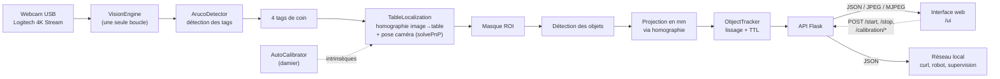

# Mat de vision — Mat-CDFR2027

Mat de vision à base de tags **ArUco** : une caméra fixée sur un mât au-dessus
d'une table de jeu repère les tags des 4 coins de la table, en déduit le repère
de la table, puis renvoie la position (x, y, angle) des objets marqués sur le
tapis via une **API REST** accessible sur le réseau local — avec une **interface
web** de pilotage intégrée.

* **Cible matérielle** : LattePanda Delta (x86, Ubuntu) + webcam USB
  Logitech 4K Stream Edition.
* **Table** : 2000 mm × 3000 mm ; tags de coin à ±400 mm / ±900 mm du centre.
* **Sortie** : JSON en millimètres dans le repère table, origine au centre.

---

## 1. Fonctionnalités

| # | Fonction | Où |
|---|----------|-----|
| 1 | **API web** Flask (JSON, CORS, aperçu JPEG, flux MJPEG, supervision) | `matvision/api.py`, `server.py` |
| 2 | **Calibration automatique** des intrinsèques (damier, sans toucher au clavier) | `matvision/calibration.py`, `calibrate.py` |
| 3 | **Module vision ArUco** : 4 tags de coin → repère table → objets | `matvision/aruco.py`, `matvision/table.py` |
| 4 | Suivi multi-objets lissé et filtrage temporel | `matvision/tracker.py` |
| 5 | **Interface web** de pilotage (flux live, plan de table, objets, calibration) | `matvision/templates/`, `matvision/static/` |
| 6 | Générateur de tags, plan de table et damier + vérificateur de tags | `tools/generate_markers.py`, `tools/check_tags.py` |

L'image complète n'est **pas** analysée : les 4 tags de coin servent d'abord à
construire le repère table, puis une **région d'intérêt (ROI)** couvrant toute la
surface de jeu ; la détection des objets n'est faite qu'à l'intérieur de cette
zone (`table.roi_mode`, voir §9).

---

## 2. Architecture



### Structure du dépôt

```
Mat-CDFR2027/
├── calibrate.py                  # CLI : calibration auto + contrôle du repère table
├── server.py                     # CLI : API REST + détection
├── config/
│   └── default.json              # configuration complète (caméra, table, objets…)
├── data/                         # calibration et captures (généré)
├── matvision/
│   ├── api.py                    # routes Flask (+ interface web)
│   ├── aruco.py                  # détecteur ArUco + utilitaires
│   ├── calibration.py            # intrinsèques : Intrinsics, AutoCalibrator
│   ├── camera.py                 # webcam USB (cv2.VideoCapture)
│   ├── config.py                 # dataclasses de configuration
│   ├── geometry.py               # Position, angles, homographie, ROI
│   ├── table.py                  # repère table (homographie + solvePnP)
│   ├── tracker.py                # suivi des objets
│   ├── vision.py                 # moteur (boucle, modes, annotations)
│   ├── templates/
│   │   └── index.html            # page de l'interface web
│   └── static/
│       ├── app.js                # logique de l'interface (vanilla JS)
│       └── style.css             # thème sombre
├── tools/
│   ├── generate_markers.py       # tags, plan de table, damier
│   └── check_tags.py             # vérifie/identifie les tags ArUco
├── tests/
│   └── test_smoke.py             # tests de bout en bout sans matériel
└── legacy/                       # anciens scripts mono-fichier (référence)
```

---

## 3. Installation

```bash
python3 -m venv .venv && source .venv/bin/activate
pip install -r requirements.txt
```

> Sur Debian/Ubuntu récent, si vous préférez les paquets système :
> `sudo apt install python3-opencv python3-flask python3-numpy`.
> `opencv-contrib-python` est **obligatoire** : le module `cv2.aruco` n'est pas
> dans `opencv-python`.

Vérification rapide de la caméra :

```bash
python3 -c "from matvision.camera import probe; print(probe(0))"
```

---

## 4. Repères et conventions

**Repère table** (millimètres), origine au **centre** de la table :

* `+x` : vers la droite (largeur 2000 mm) ;
* `+y` : vers le fond (longueur 3000 mm) ;
* `+z` : vers le haut, perpendiculaire au tapis ;
* `a` : lacet en degrés, sens trigonométrique vu du dessus, `0°` = axe `+x`,
  normalisé dans `]-180, 180]`.

**Tags de coin** (section `table.markers` de la configuration) :

| id | x (mm) | y (mm) | a (°) |
|----|--------|--------|-------|
| 20 | −400   | −900   | 0     |
| 21 | −400   | +900   | 0     |
| 22 | +400   | −900   | 0     |
| 23 | +400   | +900   | 0     |

Équivalent C du type retourné :

```c
const position_t ARUCO_POSITIONS_TABLE[] = {
    position_t{.x = -400, .y = -900, .a = 0},
    position_t{.x = -400, .y =  900, .a = 0},
    position_t{.x =  400, .y = -900, .a = 0},
    position_t{.x =  400, .y =  900, .a = 0}};
```

Les objets suivis se déclarent dans `objects` — un robot peut porter n'importe
quel tag de sa plage de couleur :

```json
"objects": [
  { "id": 1, "label": "blue",   "size": 100.0, "angle_offset": 0.0 },
  { "id": 2, "label": "blue",   "size": 100.0, "angle_offset": 0.0 },
  { "id": 3, "label": "blue",   "size": 100.0, "angle_offset": 0.0 },
  { "id": 4, "label": "blue",   "size": 100.0, "angle_offset": 0.0 },
  { "id": 5, "label": "blue",   "size": 100.0, "angle_offset": 0.0 },
  { "id": 6, "label": "yellow", "size": 100.0, "angle_offset": 0.0 },
  { "id": 7, "label": "yellow", "size": 100.0, "angle_offset": 0.0 },
  { "id": 8, "label": "yellow", "size": 100.0, "angle_offset": 0.0 },
  { "id": 9, "label": "yellow", "size": 100.0, "angle_offset": 0.0 },
  { "id": 10, "label": "yellow", "size": 100.0, "angle_offset": 0.0 },
  { "id": 13, "label": "element", "size": 100.0, "angle_offset": 0.0 }
]
```

| Plage de tags | Libellé | Rôle |
|---|---|---|
| `1` … `5` | `blue` | robots bleus (chaque robot porte l'un de ces tags) |
| `6` … `10` | `yellow` | robots jaunes |
| `13` | `element` | élément de jeu (un seul type : plusieurs exemplaires peuvent partager ce tag, le tracker les distingue par leur position) |

Le suivi se fait par identifiant de tag, l'API regroupe par **libellé** : deux
robots bleus portant les tags 1 et 3 apparaissent comme deux entrées sous la clé
`blue`. C'est ce qui permettra d'exposer `/blue` et `/yellow`.

`angle_offset` corrige l'orientation si le « devant » de l'objet n'est pas dans
l'axe `+x` du tag (cas fréquent pour un robot). `size` est informatif : la
localisation plane (homographie) ne dépend pas de la taille du tag.

> **Tags supportés.** Le dictionnaire `DICT_4X4_50` couvre les identifiants
> **0 à 49** ; les identifiants `0` à `49` ont exactement le même motif dans
> `DICT_4X4_100/250/1000` (ces dictionnaires sont emboîtés). Un tout autre
> dictionnaire (`DICT_5X5_100`, `DICT_APRILTAG_36H11`…) repousse la limite
> jusqu'à 1000. Le moteur ne conserve toutefois que les tags déclarés ici et
> dans `table.markers` — **tout autre tag est détecté puis ignoré**.

---

## 5. Générer les tags, le plan de table et le damier

```bash
# Tous les tags de la configuration (coins 20-23, robots 1 et 6, élément 13)
python tools/generate_markers.py --sheet

# Idem en choisissant explicitement les identifiants
python tools/generate_markers.py --ids 1,6,13,20-23 --sheet

# Plan de table à l'échelle 1:4, tags placés à leur position réelle
python tools/generate_markers.py --plan --plan-scale 0.25

# Damier imprimable à l'échelle 1:1 (300 dpi)
python tools/generate_markers.py --chessboard --dpi 300
```

Les fichiers sont écrits dans `data/markers/`. Imprimez le damier **à 100 %**
(« taille réelle »), puis mesurez une case pour vérifier la cote avant la
calibration.

### 5.1 Vérifier les tags

```bash
python tools/check_tags.py                  # contrôle la configuration
python tools/check_tags.py --identify photo.png   # identifie un tag imprimé
python tools/check_tags.py --patterns       # affiche le motif binaire de chaque tag
```

L'outil contrôle que :

* chaque identifiant existe bien dans le dictionnaire (un `id` hors plage passe
  inaperçu au démarrage et rend l'objet invisible) ;
* chaque tag se décode correctement, seul et sous dégradation (flou, bruit,
  compression JPEG, perspective) ;
* aucune paire de tags n'est trop proche dans le dictionnaire. La « marge » est
  le nombre de bits qui séparent deux tags : plus elle est grande, moins un tag
  peut être confondu avec un autre.

Exemple :

```
=== Marge de sécurité (bits vs le plus proche des autres tags du projet) ===
  tag   1 : 3 bits (plus proche : tag 6)   <-- marge faible
  tag   2 : 4 bits (plus proche : tag 8)
  ...

=== Risque d'échange entre catégories ===
  blue     <-> yellow   : 3 bits (tags 1 / 6)
  blue     <-> element  : 3 bits (tags 1 / 13)
  blue     <-> coin     : 4 bits (tags 3 / 20)
```

Si un tag imprimé ne se décode pas, `--identify` indique à quel identifiant et
à quel dictionnaire il correspond réellement.

> **Mesuré sur ce projet :** les 15 tags configurés décodent correctement et
> **aucune confusion n'a été observée sur 7 680 essais dégradés** (jusqu'à 34 px
> de côté avec flou, bruit et JPEG de mauvaise qualité). Le mode d'échec est
> toujours « tag absent », jamais « mauvais identifiant » — et un tag manqué une
> image est absorbé par `detection.max_age_s`.

---

## 6. Calibration automatique de la caméra

### 6.1 Intrinsèques (damier)

Aucune touche à enfoncer : le script capture les vues dès qu'elles sont nettes,
complètes, correctement cadrées et **suffisamment différentes** de la précédente.

```bash
python calibrate.py --device 0 --frames 20
```

* `--grid 7 7` : nombre de **coins internes** du damier (défaut 7×7) ;
* `--square-size 25` : côté d'une case en mm ;
* `--no-display` : mode sans fenêtre (SSH) ;
* `--output data/camera_calibration.json`.

Sortie : `data/camera_calibration.json` (matrice intrinsèque + distorsion +
erreur de reprojection). Les anciens fichiers `data/camera_calibration.yml`
produits par `legacy/calibrate_camera.py` restent lisibles.

Critères de capture automatique (réglables dans `calibration`) :

| Critère | Champ | Défaut |
|---|---|---|
| Damier vu | — | obligatoire |
| Surface / image | `min_board_area_ratio` … `max_board_area_ratio` | 4 % … 95 % |
| Netteté (variance du Laplacien) | `min_sharpness` | 60 |
| Distance au bord | `border_margin_px` | 10 px |
| Déplacement vs vue précédente | `min_move_ratio` | 12 % de la diagonale |

#### Faut-il recalibrer à chaque démarrage ?

**Non.** La calibration est faite une fois, écrite dans
`data/camera_calibration.json`, puis **rechargée automatiquement à chaque
démarrage**. Le moteur ne déclenche jamais de calibration tout seul : elle ne
part que sur `python calibrate.py` ou `POST /calibration/start`.

À refaire uniquement si :

| Changement | Recalibrer ? |
|---|---|
| Redémarrage de la LattePanda ou du service | non |
| **Changement de résolution** (`camera.width/height`) | **oui** ⚠ |
| Réglage de la mise au point (bague de la webcam) | oui |
| Changement de caméra, d'objectif ou de zoom numérique | oui |
| Déplacement du mât, de la table ou des tags de coin | **non** (le repère table est recalculé à chaque image) |

⚠️ **Les intrinsèques sont exprimés en pixels** : une calibration faite en
1920×1080 est fausse pour un flux en 3840×2160. Le moteur détecte cet écart au
premier image et le signale (`/status` → `intrinsics_warning`, journal, et
panneau « Repère & caméra » de l'interface web).

Bonne nouvelle : **sans aucune calibration, le mat fonctionne**. Les positions
des objets (x, y, a) viennent de l'**homographie** des 4 tags de coin, pas des
intrinsèques. Seule la pose caméra de `/position` (diagnostic) nécessite une
calibration à jour.

### 6.2 Vérification du repère table

```bash
python calibrate.py --check-table
```

Affiche le nombre de tags de coin détectés, le résidu de l'homographie (mm), le
nombre d'inliers et la pose de la caméra. Code de retour `0` si les 4 tags sont
vus et l'homographie stable.

---

## 7. Lancer le serveur

```bash
python server.py                  # API sur 0.0.0.0:5000, détection à la demande
python server.py --autostart      # détection lancée immédiatement
python server.py --display        # + fenêtre locale d'aperçu
python server.py --device 1 --width 3840 --height 2160
```

L'API démarre même si la caméra est absente : le moteur retente l'ouverture
toutes les 2 s et `/health` renvoie alors `ok: false`.

### 7.1 Interface web

Ouvrez simplement `http://<ip-lattepanda>:5000/` (ou `/ui`) dans un navigateur,
depuis n'importe quelle machine du réseau local :

```bash
xdg-open http://localhost:5000/ui
```

L'interface (HTML/CSS/JS **sans aucune dépendance externe**, donc fonctionnelle
hors ligne) donne accès à :

| Élément | Détail |
|---|---|
| **Aperçu caméra** | flux MJPEG temps réel, choix de la qualité, arrêt du flux pour économiser le CPU |
| **Commandes** | Démarrer / Arrêter / Réinitialiser / Snapshot |
| **Plan de la table** | vue de dessus en direct : tags de coin, objets avec leur cap, axes x/y |
| **Objets détectés** | tableau libellé, tag, x, y, a, ancienneté |
| **Repère & caméra** | mode, résolution, fps, verrouillage du repère, inliers, résidu, pose caméra, intrinsèques |
| **Calibration** | lancement à distance, barre de progression, message d'état, résultat (fx/fy, erreur) |

Détails techniques utiles :

* `/` **négocie le contenu** : un navigateur reçoit la page HTML, `curl` reçoit
  le JSON de découverte — vos scripts existants continuent de fonctionner ;
* le flux `/stream` est un `multipart/x-mixed-replace` bornable
  (`?fps=12&quality=75&frames=0&max_seconds=300`), utilisable aussi depuis une
  simple balise `` ou depuis OpenCV (`cv2.VideoCapture("http://…/stream")`) ;
* les fichiers statiques ne sont pas mis en cache, pour que les modifications de
  l'interface soient visibles immédiatement après un rechargement.

---

## 8. Référence de l'API

| Méthode | Route | Description |
|---|---|---|
| `GET` | `/` | Interface web (navigateur) ou découverte JSON (curl) |
| `GET` | `/ui` | Interface web de pilotage |
| `GET` | `/api` | Découverte JSON : version + liste des routes |
| `GET` | `/health` | Test de vie (supervision) |
| `GET` | `/status` | État complet : caméra, mode, table, fps, erreurs |
| `GET`/`POST` | `/start` | Démarre la détection |
| `GET`/`POST` | `/stop` | Arrête la détection |
| `GET`/`POST` | `/reset` | Réinitialise le suivi (alias `/reset_tracking`) |
| `GET` | `/objects` | Objets détectés, repère table (mm, degrés) |
| `GET` | `/objects/<clé>` | Objets d'un tag (`36`) ou d'un libellé (`bleu`) |
| `GET` | `/position` | Pose de la caméra dans le repère table |
| `GET` | `/table` | Géométrie de la table, tags de coin, objets |
| `GET` | `/preview` | Dernière image annotée (JPEG, `?quality=`) |
| `GET` | `/stream` | Flux MJPEG temps réel (`?fps=`, `?frames=`, `?max_seconds=`) |
| `GET` | `/config` | Configuration effective |
| `POST` | `/calibration/start` | Lance la calibration automatique |
| `GET` | `/calibration/status` | Progression (vues capturées, message) |
| `POST` | `/calibration/stop` | Annule la calibration |
| `GET` | `/calibration/result` | Intrinsèques courantes |
| `POST` | `/snapshot` | Enregistre l'image courante (`?path=`) |

### Exemples

```bash
# Lancement puis lecture des positions
curl http://192.168.1.50:5000/start
curl http://192.168.1.50:5000/objects
```

```json
{
  "objects": {
    "blue": [
      { "id": 1, "label": "blue", "x": 412.3, "y": -318.7, "z": 0.0, "a": 92.4,
        "hits": 134, "missing": 0, "age_s": 4.51, "seen_ago_s": 0.001 }
    ],
    "element": [
      { "id": 13, "label": "element", "x": -640.0, "y": 880.5, "z": 0.0, "a": 0.8 },
      { "id": 13, "label": "element", "x":  705.2, "y": -410.9, "z": 0.0, "a": 45.3 }
    ]
  },
  "list": [ { "id": 1, "label": "blue", "x": 412.3, "y": -318.7, "z": 0.0, "a": 92.4 } ]
}
```

> Deux éléments de jeu partagent le tag `13` : ils apparaissent comme **deux
> entrées distinctes** sous la clé `element`, distinguées par leur position.

```bash
# Pose caméra + qualité du repère table
curl http://192.168.1.50:5000/position

# Aperçu annoté (image unique)
curl -o preview.jpg http://192.168.1.50:5000/preview

# Flux temps réel : lecture directe dans OpenCV
# python -c "import cv2; cap = cv2.VideoCapture('http://192.168.1.50:5000/stream?fps=10')"

# Calibration à distance
curl -X POST http://192.168.1.50:5000/calibration/start
curl http://192.168.1.50:5000/calibration/status
```

---

## 9. Réglages utiles (`config/default.json`)

| Besoin | Clé |
|---|---|
| Passer en 4K | `camera.width` = 3840, `camera.height` = 2160 |
| Fluidité sur LattePanda | `camera.width/height` = 1280×720, `detection.draw` = false |
| Positions plus lisses | `detection.smoothing` ↑ (0.4 → 0.7) |
| Objets plus réactifs | `detection.smoothing` ↓ (0.4 → 0.15) |
| Disparition plus rapide | `detection.max_age_s` ↓ (1.0 → 0.4) |
| Marge de la ROI | `table.roi_margin_px` |
| Robustesse du repère table | `detection.min_homography_inliers` ↑ |

### Zone analysée (`table.roi_mode`)

Les tags de coin sont à ±400 mm en x alors que la table mesure 2000 mm : le
quadrilatère des tags ne couvre **pas** tout le tapis.

| Valeur | Zone analysée | Quand l'utiliser |
|---|---|---|
| `"table"` *(défaut)* | toute la surface de jeu, reconstruite par homographie | les objets peuvent aller près des bords |
| `"markers"` | quadrilatère des 4 tags de coin (+ marge) | zone de jeu restreinte entre les tags, un peu plus rapide et moins de faux positifs |

Avec `"table"`, un objet posé à x = 520 mm (hors des tags) est bien détecté ;
avec `"markers"` il est invisible. Vérifiable via `tests/test_smoke.py`.

Toute modification de `config/default.json` est prise en compte au démarrage
suivant. `--config autre.json` permet de gérer plusieurs terrains.

### Choix de la résolution

Les tags de coin ne mesurent que 100 mm sur un terrain de 3000 mm de long : la
résolution d'image conditionne donc directement la détection. Pour couvrir
2000 mm de champ sur la hauteur de l'image :

| Résolution | px / mm | Taille d'un tag 100 mm | px par cellule (4×4) |
|---|---|---|---|
| 1280×720 | 0,36 | ~36 px | ~6 px ⚠ |
| 1920×1080 | 0,54 | ~54 px | ~9 px |
| **3840×2160 (4K)** | **1,08** | **~108 px** | **~18 px ✓** |

La Logitech 4K Stream Edition permet `camera.width: 3840`, `camera.height: 2160`,
`fourcc: MJPG`. Si le CPU de la LattePanda Delta sature, réduisez d'abord
`detection.draw` puis la résolution — ou ne détectez les tags de coin qu'en
basse résolution et les objets en pleine résolution.

---

## 10. Tests (sans matériel)

La suite de tests de fumée génère une scène synthétique (caméra en visée
plongeante, tags de coin et objets) et vérifie toute la chaîne, y compris l'API
avec une caméra factice :

```bash
python tests/test_smoke.py
```

Couverture : géométrie et conventions d'angle, détection ArUco, homographie du
repère table et pose caméra, projection des objets en mm/deg, ROI, suivi,
sérialisation de la calibration, calibration automatique sur damier synthétique,
toutes les routes de l'API, et l'interface web (page HTML, ressources statiques,
négociation de contenu, flux MJPEG borné).

Exemple de sortie :

```
  ok  détection ArUco : 6 tags, 0 rejetés ; repere table (residu 1.38 mm, pose a 5.0 mm, erreur 0.770 px)
  ok  projection des objets en mm et en degrés (erreur < 6 mm, < 3°)
  ok  ROI : 17% de l'image conservée, objets toujours détectés
  ok  calibration automatique : 8 vues, fx=800.3 (vérité 800), cx=640.8, rms=0.065 px
  ok  moteur + API : 2 objets suivis, aperçu JPEG de 80926 octets, fps 8.0
  ok  interface web : page HTML, ressources statiques, négociation de contenu, flux MJPEG (161976 octets)
```

---

## 11. Dépannage

| Symptôme | Piste |
|---|---|
| `impossible d'ouvrir la caméra` | `ls -l /dev/video*`, essayer `--device 1`, vérifier qu'aucune autre appli n'utilise la caméra |
| Image très sombre / surexposée | fixer l'exposition dans `camera` (`auto_exposure: false`) et éclairer la table |
| `0 tag de coin détecté` | vérifier le dictionnaire (`DICT_4X4_50`), la taille des tags, l'éclairage, et que le plan de table est bien visible |
| `homographie instable` | tags corrompus/flous, table mal plane, ou positions `table.markers` erronées |
| Objets jamais renvoyés | ids absents de `objects`, tags trop petits (voir `minMarkerPerimeterRate`) |
| Latence / fps faible | réduire la résolution, désactiver `detection.draw`, passer en `fourcc: MJPG` |
| `ModuleNotFoundError: cv2.aruco` | installer `opencv-contrib-python`, pas `opencv-python` |

---

## 12. Anciens scripts

La version mono-fichier d'origine (Raspberry Pi / picamera2, `cv2.FileStorage`)
est conservée dans `legacy/` à titre de référence :
`detect_aruco.py`, `pi_detect_aruco.py`, `calibrate_camera.py`,
`pi_calibrate_camera.py`. Elle reste fonctionnelle mais n'est plus maintenue ;
les nouvelles fonctionnalités se font dans le paquet `matvision`.

`legacy/calibrate_camera.py` produit `data/camera_calibration.yml`, un format
que `matvision.calibration.load_intrinsics` sait toujours relire : vous pouvez
donc réutiliser une calibration existante sans recalibrer.